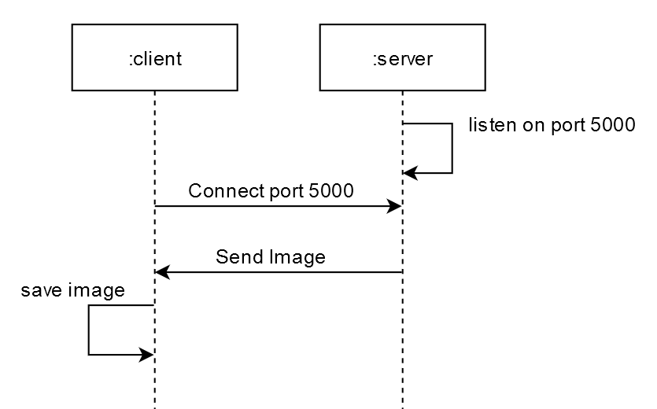

# SOFACE-assignment-6

**It is strongly recommended to use the VM for this assignment, due to the difficulty of installing third-party packages on non-unix systems.**
(I got stuck in a rabbit hole trying to install this for windows)
If you have no virtual machine, the following is needed:
https://ubuntu.com/tutorials/how-to-run-ubuntu-desktop-on-a-virtual-machine-using-virtualbox#1-overview
From there you need visual studio code and git (simple google searches should be able to guide you there)
And then use the install command located lower in this readme for "boost" which we use for networking. 


During this exercise we will take a look at how network programming can be implemented in C/C++.
Specifically we will implment a client-server pattern which allows an client to download an image from a server.

The client server is a common architecture used throughout the internet, a classicial example being a web-browser loading a webpage.
Here the webbrowser acts as the client and the server is program deployed to some machine, which loads the webpage from a database and sends the response to the client.

It should be stressed that the server and client are simply two computer programs that communicate with eachother.
Traditionally, we think of servers as running on different machines, but there is no limitation of where these programs are running. **During this exercise you will be running both client and server on you own local machine.**



## Installing Networking Library

Since TCP and UDP sockets are not currently part of the C++ standard library, we must install a thirdparty library that takes care of this for us.

We will be using the `boost::asio` library which is part of the [boost](https://www.boost.org/) ecosystem of packages, which provides portable code for some of the functionality that is not part of the C++ standard library.

To install boost on ubuntu use the following command:

```
sudo apt-get install libboost-all-dev
```

Note that different networking related frameworks such as boost::asio target different levels of networking abstractions. In other words if you are implementing a new video streaming protocol you would pick another library than if you were writing a program that fetches an image using http.

The choice of `Boost::asio` lets us build the application directly on top of the transport layer that does not rely on other application layer protocols such as HTTP.
This is a purely didactical choice, hopefully leading to a better understanding of what a client and server really are.


## Automated Testing of Networking

One challenging aspect of developing networked applications is testing.
The fact that client and server have to be running on seperate threads makes it somewhat harder to do automated testing.

**As such the test cases you are used to seeing will not be provided for this exercise and we will instead rely on manual testing, e.g. inspecting the transmitted image to see if things went well.**

## Exercise

The exercise is split into two parts: (1) you will review an example of a simple network application for fetching the current time from a server. (2) you will extend the example to send an image as a series of bytes rather a text string describing the date.

### Daytime server

1. Inspect the following files `daytime_client.cpp` and `daytime_server.cpp`. Add your own notes in form of comments describing the what the different methods does. Focus on the high level structure like where data structures are initialized and where the reading and writing to the socket occurs.

2. Compile and test the programs. Start the server from a seperate terminal (the server program will loop indefinitely)
   ```bash
   ./daytime_server
   ```
   then from another terminal start the client, specifiying the "127.0.0.1" (this is a special loopback address)
   ```bash
   ./daytime_client 127.0.0.1
   Fri Mar 12 11:07:48 2021
   ```

### Image Transmission

The next step in this exercise is to modify the existing programs to send an image instead of a string.
Like any other file on your computer an image is represented by a number of bytes.
What makes it an image rather than an blob of bytes is simply that we encode and intepret these bytes as an image. An file extension like '.png' is one way to indicate that the contents of an file should be treated as an image.

1. Examine the following files `image_client.cpp` and `image_server.cpp`

2. Implement the `get_image` function in `image_server.cpp`, this load the contents of the `cat.jpg` file into a vector of bytes. You may have to `cat.jpg` the image into the directory in which the program is launched from, i.e. if you launch the program from build, then the image should be copied to this directory.

3. Implement the `save_image` in `image_client.cpp`, this should store the received bytes as an image `copycat.jpg`.

4. Start the image server and then the image client, does the `copycat.jpg` appear? If not make the necessary changes to the programs and verify that the image is transmitted.

**Hint you can implement all the code for reading and writing images in `main.cpp` first and integrate later to avoid the hassle of dealing with sockets.**
